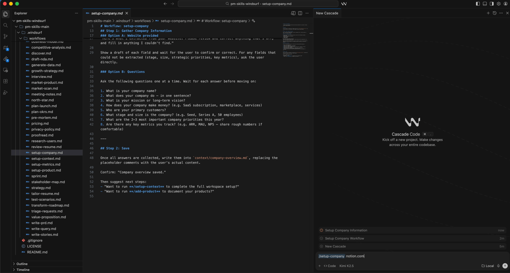

[](https://github.com/phuryn/pm-skills/blob/main/LICENSE)

# PM Skills for Windsurf

> 65 PM skills and 39 workflows for Windsurf's Cascade AI. From discovery to strategy, execution, launch, and growth.



A Windsurf-native conversion of the [PM Skills Marketplace](https://github.com/phuryn/pm-skills) by Paweł Huryn + additional workflows for setting up the company, products, and competitors context. Skills and frameworks are preserved in full — adapted from Claude Code's plugin format into Windsurf Rules and Workflows.

So I added that.

Three setup workflows that run once when you start:
— walks you through your company (or just grabs it from your website)
— creates a folder per product with context and requirements
— pulls competitive analysis automatically

## Start Here

First-time setup? → `/setup-context`

New idea? → `/discover`
Need strategic clarity? → `/strategy`
Writing a PRD? → `/write-prd`
Planning a launch? → `/plan-launch`
Defining metrics? → `/north-star`

## Why PM Skills for Windsurf?

Generic AI gives you text. PM Skills gives you structure.

Each skill encodes a proven PM framework — discovery, assumption mapping, prioritization, strategy — and walks you through it step by step. You get the rigor of Teresa Torres, Marty Cagan, and Alberto Savoia built into your daily workflow, not sitting on a bookshelf.

The result: better product decisions, not just faster documents.

## How It Works

**Skills** are PM frameworks and domain knowledge loaded into Cascade as context. Reference them with `@skill-name` when you need a specific methodology without running a full guided workflow.

**Workflows** are user-triggered, step-by-step processes invoked with `/workflow-name`. They chain skills into end-to-end processes. For example, `/discover` chains brainstorm-ideas → identify-assumptions → prioritize-assumptions → brainstorm-experiments.

Every workflow starts by reading your `context/` folder — company overview, product details, and competitive landscape — to produce outputs tailored to your specific company and products.

## Setup

**1. Open this folder in Windsurf**

**2. Run the setup workflow** to populate your workspace context:
```
/setup-context
```
This walks you through documenting your company, products, and competitive landscape (~10 minutes). All other workflows use this context to produce tailored outputs.

**3. Add more products anytime:**
```
/setup-product
```

---

## Available Workflows

### Workspace Setup

| Workflow | Description |
|---|---|
| `/setup-context` | Full first-time setup — company, products, and competitive landscape |
| `/setup-company` | Set up or update company overview only |
| `/setup-product` | Add one or more products to the context folder |

---

### 1. Product Discovery

Continuous product discovery: ideation, experiments, assumption testing, feature prioritization, Opportunity Solution Trees, and customer interviews.

**Skills (13):**

- `skill-brainstorm-ideas-existing` — Multi-perspective ideation for existing products (PM, Designer, Engineer)
- `skill-brainstorm-ideas-new` — Ideation for new products in initial discovery
- `skill-brainstorm-experiments-existing` — Design experiments to test assumptions for existing products
- `skill-brainstorm-experiments-new` — Design lean startup pretotypes for new products (Alberto Savoia)
- `skill-identify-assumptions-existing` — Identify risky assumptions across Value, Usability, Viability, and Feasibility
- `skill-identify-assumptions-new` — Identify risky assumptions across 8 risk categories including Go-to-Market, Strategy, and Team
- `skill-prioritize-assumptions` — Prioritize assumptions using an Impact × Risk matrix with experiment suggestions
- `skill-prioritize-features` — Prioritize a feature backlog based on impact, effort, risk, and strategic alignment
- `skill-analyze-feature-requests` — Analyze and categorize customer feature requests by theme and strategic fit
- `skill-opportunity-solution-tree` — Build an Opportunity Solution Tree (Teresa Torres) — outcome → opportunities → solutions → experiments
- `skill-interview-script` — Create a structured customer interview script with JTBD probing questions
- `skill-summarize-interview` — Summarize an interview transcript into JTBD, satisfaction signals, and action items
- `skill-metrics-dashboard` — Design a product metrics dashboard with North Star, input metrics, and alert thresholds

**Workflows (5):**

- `/discover` — Full discovery cycle: ideation → assumption mapping → prioritization → experiment design
- `/brainstorm` — Multi-perspective ideation (ideas or experiments × existing or new product)
- `/triage-requests` — Analyze and prioritize a batch of feature requests
- `/interview` — Prepare an interview script or summarize a transcript
- `/setup-metrics` — Design a product metrics dashboard

**Examples:**

```
/discover AI-powered meeting summarizer for remote teams
/brainstorm experiments existing — We need to reduce churn in our onboarding flow
/interview prep — We're interviewing enterprise buyers about their procurement workflow
```

---

### 2. Product Strategy

Product strategy, vision, business models, pricing, and macro environment analysis.

**Skills (12):**

- `skill-product-strategy` — Comprehensive 9-section Product Strategy Canvas (vision → defensibility)
- `skill-startup-canvas` — Startup Canvas combining Product Strategy + Business Model
- `skill-product-vision` — Craft an inspiring, achievable, and emotional product vision
- `skill-value-proposition` — 6-part JTBD value proposition (Who, Why, What before, How, What after, Alternatives)
- `skill-lean-canvas` — Lean Canvas business model for startups and new products
- `skill-business-model` — Business Model Canvas with all 9 building blocks
- `skill-monetization-strategy` — Brainstorm 3–5 monetization strategies with validation experiments
- `skill-pricing-strategy` — Pricing models, competitive analysis, willingness-to-pay, and price elasticity
- `skill-swot-analysis` — SWOT analysis with actionable recommendations
- `skill-pestle-analysis` — Macro environment: Political, Economic, Social, Technological, Legal, Environmental
- `skill-porters-five-forces` — Competitive forces analysis (rivalry, suppliers, buyers, substitutes, new entrants)
- `skill-ansoff-matrix` — Growth strategy mapping across markets and products

**Workflows (5):**

- `/strategy` — Create a complete 9-section Product Strategy Canvas
- `/business-model` — Explore business models (lean, full, startup, value-prop)
- `/value-proposition` — Design a value proposition using the 6-part JTBD template
- `/market-scan` — Macro environment analysis combining SWOT + PESTLE + Porter's + Ansoff
- `/pricing` — Design a pricing strategy with competitive analysis and experiments

**Examples:**

```
/strategy B2B project management tool for agencies
/business-model startup — AI writing tool for non-native English speakers
/value-proposition SaaS onboarding tool for enterprise customers
```

---

### 3. Execution

Day-to-day product management: PRDs, OKRs, roadmaps, sprints, retrospectives, release notes, pre-mortems, stakeholder management, user stories, and prioritization frameworks.

**Skills (15):**

- `skill-create-prd` — Comprehensive 8-section PRD template
- `skill-brainstorm-okrs` — Team-level OKRs aligned with company objectives
- `skill-outcome-roadmap` — Transform a feature list into an outcome-focused roadmap
- `skill-sprint-plan` — Sprint planning with capacity estimation, story selection, and risk identification
- `skill-retro` — Structured sprint retrospective facilitation
- `skill-release-notes` — User-facing release notes from tickets, PRDs, or changelogs
- `skill-pre-mortem` — Risk analysis with Tigers/Paper Tigers/Elephants classification
- `skill-stakeholder-map` — Power × Interest grid with tailored communication plan
- `skill-summarize-meeting` — Meeting transcript → decisions + action items
- `skill-user-stories` — User stories following the 3 C's and INVEST criteria
- `skill-job-stories` — Job stories: When [situation], I want to [motivation], so I can [outcome]
- `skill-wwas` — Product backlog items in Why-What-Acceptance format
- `skill-test-scenarios` — Test scenarios: happy paths, edge cases, error handling
- `skill-dummy-dataset` — Realistic dummy datasets as CSV, JSON, SQL, or Python
- `skill-prioritization-frameworks` — Reference guide to 9 prioritization frameworks (ICE, RICE, MoSCoW, Kano, etc.)

**Workflows (10):**

- `/write-prd` — Create a PRD from a feature idea or problem statement
- `/plan-okrs` — Brainstorm team-level OKRs
- `/transform-roadmap` — Convert a feature-based roadmap into outcome-focused
- `/sprint` — Sprint lifecycle: plan, retro, or release notes
- `/pre-mortem` — Pre-mortem risk analysis on a PRD or launch plan
- `/meeting-notes` — Summarize a meeting transcript into structured notes
- `/stakeholder-map` — Map stakeholders and create a communication plan
- `/write-stories` — Break features into backlog items (user, job, or wwa format)
- `/test-scenarios` — Generate test scenarios from user stories
- `/generate-data` — Create realistic dummy datasets

**Examples:**

```
/write-prd Smart notification system that reduces alert fatigue
/sprint retro — Here are the notes from our last sprint
/write-stories job — Break down the "team dashboard" feature into job stories
```

---

### 4. Market Research

User research and competitive analysis: personas, segmentation, journey maps, market sizing, competitor analysis, and feedback analysis.

**Skills (7):**

- `skill-user-personas` — Create refined user personas from research data
- `skill-market-segments` — Identify 3–5 customer segments with demographics, JTBD, and product fit
- `skill-user-segmentation` — Segment users from feedback data based on behavior, JTBD, and needs
- `skill-customer-journey-map` — End-to-end journey map with stages, touchpoints, emotions, and pain points
- `skill-market-sizing` — TAM, SAM, SOM with top-down and bottom-up approaches
- `skill-competitor-analysis` — Competitor strengths, weaknesses, and differentiation opportunities
- `skill-sentiment-analysis` — Sentiment analysis and theme extraction from user feedback

**Workflows (3):**

- `/research-users` — Build personas, segment users, and map the customer journey
- `/competitive-analysis` — Analyze the competitive landscape
- `/analyze-feedback` — Sentiment analysis and segment insights from user feedback

**Examples:**

```
/research-users We have interview data from 12 users of our fitness app
/competitive-analysis Figma competitors in the design tool space
/analyze-feedback Here's 200 NPS responses from Q4 [attach file]
```

---

### 5. Data & Analytics

SQL query generation, cohort analysis, and A/B test analysis.

**Skills (3):**

- `skill-sql-queries` — Generate SQL from natural language (BigQuery, PostgreSQL, MySQL)
- `skill-cohort-analysis` — Retention curves, feature adoption, and engagement trends by cohort
- `skill-ab-test-analysis` — Statistical significance, sample size validation, and ship/extend/stop recommendations

**Workflows (3):**

- `/write-query` — Generate SQL queries from natural language
- `/analyze-cohorts` — Cohort analysis on user engagement data
- `/analyze-test` — Analyze A/B test results

**Examples:**

```
/write-query Show me monthly active users by country for Q4 2025 (BigQuery)
/analyze-test Here are the results from our checkout flow A/B test [attach CSV]
/analyze-cohorts Weekly retention for users who signed up in January vs February
```

---

### 6. Go-to-Market

GTM strategy: beachhead segments, ideal customer profiles, growth loops, GTM motions, and competitive battlecards.

**Skills (6):**

- `skill-gtm-strategy` — Full GTM strategy: channels, messaging, success metrics, and launch plan
- `skill-beachhead-segment` — Identify the first beachhead market segment
- `skill-ideal-customer-profile` — ICP with demographics, behaviors, JTBD, and needs
- `skill-growth-loops` — Design sustainable growth loops (flywheels)
- `skill-gtm-motions` — Evaluate GTM motions (product-led, sales-led, etc.)
- `skill-competitive-battlecard` — Sales-ready battlecard with objection handling and win strategies

**Workflows (3):**

- `/plan-launch` — Full GTM strategy from beachhead to launch plan
- `/growth-strategy` — Design growth loops and evaluate GTM motions
- `/battlecard` — Create a competitive battlecard

**Examples:**

```
/plan-launch AI code review tool targeting mid-size engineering teams
/battlecard Our CRM vs Salesforce for the SMB market
/growth-strategy Two-sided marketplace for connecting freelancers with startups
```

---

### 7. Marketing & Growth

Product marketing: positioning, value proposition statements, product naming, and North Star metrics.

**Skills (5):**

- `skill-marketing-ideas` — Creative, cost-effective marketing ideas with channels and messaging
- `skill-positioning-ideas` — Product positioning differentiated from competitors
- `skill-value-prop-statements` — Value proposition statements for marketing, sales, and onboarding
- `skill-product-name` — Product name brainstorming aligned to brand values and audience
- `skill-north-star-metric` — North Star Metric + input metrics with business game classification

**Workflows (2):**

- `/market-product` — Brainstorm marketing ideas, positioning, value props, and product names
- `/north-star` — Define your North Star Metric and supporting input metrics

**Examples:**

```
/market-product B2B analytics dashboard for e-commerce managers
/north-star Two-sided marketplace connecting freelancers with clients
```

---

### 8. Toolkit

PM utilities: resume review, legal documents, and proofreading.

**Skills (4):**

- `skill-review-resume` — PM resume review against 10 best practices (XYZ+S formula, keywords, structure)
- `skill-draft-nda` — Non-Disclosure Agreement with jurisdiction-appropriate clauses
- `skill-privacy-policy` — Privacy policy covering GDPR/CCPA compliance
- `skill-grammar-check` — Grammar, logic, and flow checking with targeted fixes

**Workflows (5):**

- `/review-resume` — Comprehensive PM resume review
- `/tailor-resume` — Tailor a resume to a specific job description
- `/draft-nda` — Draft an NDA
- `/privacy-policy` — Draft a privacy policy
- `/proofread` — Check grammar, logic, and flow

**Examples:**

```
/review-resume [attach your PM resume]
/tailor-resume [attach resume + paste job description]
/proofread Here's the draft of our Q1 investor update
```

---

## About

### Credits

This project is a Windsurf adaptation of the **[PM Skills Marketplace](https://github.com/phuryn/pm-skills)** created by **[Paweł Huryn](https://www.productcompass.pm)**. All PM skills, frameworks, and workflows were originally authored by Paweł and are reproduced here with full attribution under the MIT license.

Paweł curates the [Product Compass Newsletter](https://www.productcompass.pm) — one of the most comprehensive PM resources available.

### Frameworks

Skills are based on the work of:

- Teresa Torres — [*Continuous Discovery Habits*](https://www.amazon.com/Continuous-Discovery-Habits-Discover-Products/dp/1736633309/)
- Marty Cagan — [*INSPIRED*](https://www.amazon.com/INSPIRED-Create-Tech-Products-Customers/dp/1119387507/) and [*TRANSFORMED*](https://www.amazon.com/dp/1119697336/)
- Alberto Savoia — [*The Right It*](https://www.amazon.com/Right-Many-Ideas-Yours-Succeed/dp/0062884654)
- Dan Olsen — [*The Lean Product Playbook*](https://www.amazon.com/dp/1118960874/)
- Roger L. Martin — [*Playing to Win*](https://www.amazon.com/Playing-Win-Expanded-Bonus-Articles/dp/B0F25SDYWV/)
- Ash Maurya — [*Running Lean*](https://www.amazon.com/dp/B004J4XGN6/)
- Strategyzer — [*Business Model Generation*](https://www.amazon.com/dp/0470876417/) and [*Value Proposition Design*](https://www.amazon.com/dp/1118968050/)
- Christina Wodtke — [*Radical Focus*](https://www.amazon.com/Radical-Focus-Achieving-Important-Objectives/dp/0996006052)
- Anthony W. Ulwick — [*Jobs to Be Done*](https://jobs-to-be-done-book.com/)
- Alistair Croll & Benjamin Yoskovitz — [*Lean Analytics*](https://www.amazon.com/Lean-Analytics-Better-Startup-Faster/dp/1449335675/)
- Sean Ellis — [*Hacking Growth*](https://www.amazon.com/Hacking-Growth-Fastest-Growing-Companies-Breakout/dp/045149721X/)
- Maja Voje — [*Go-To-Market Strategist*](https://gtmstrategist.com/)

## License

MIT — see the [original repository](https://github.com/phuryn/pm-skills/blob/main/LICENSE).
